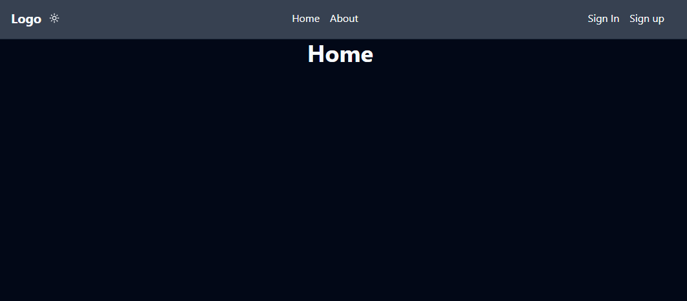
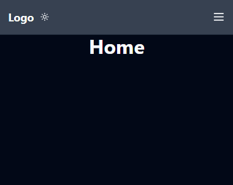
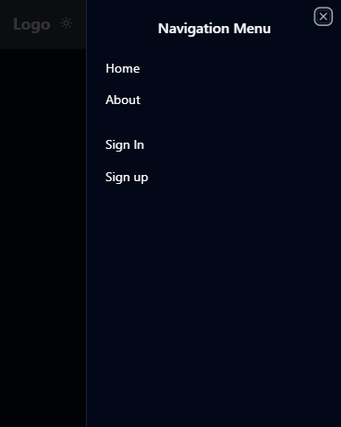
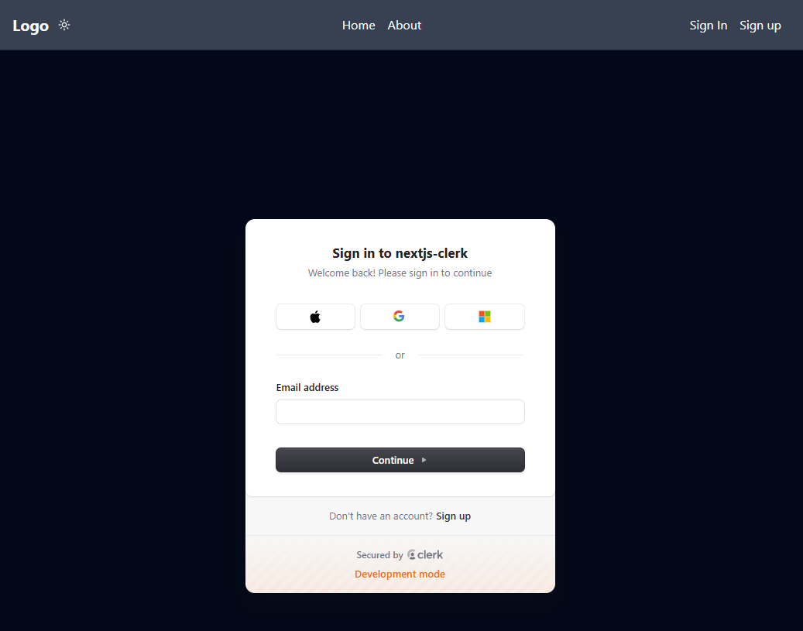
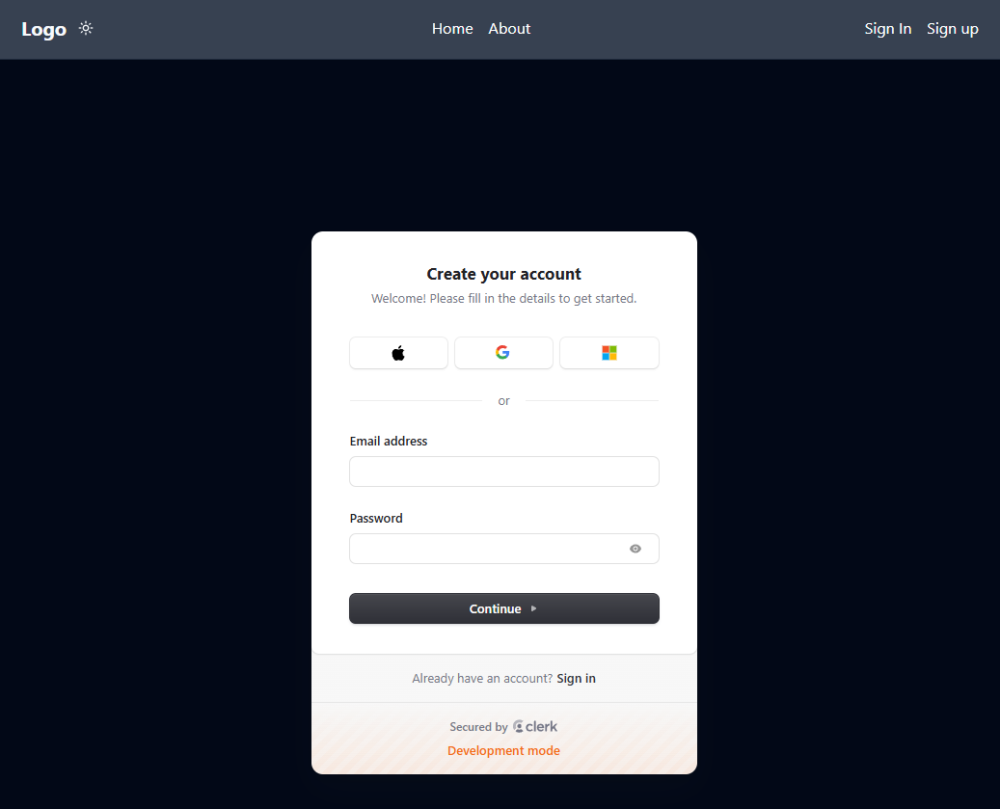
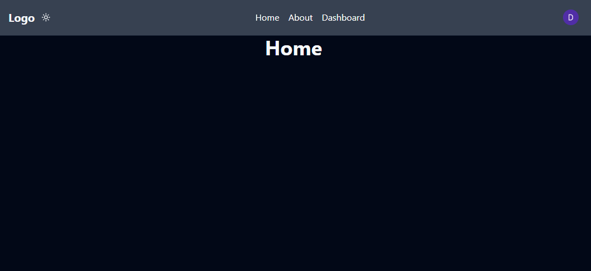
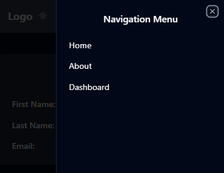
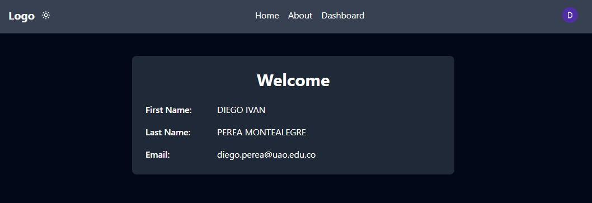
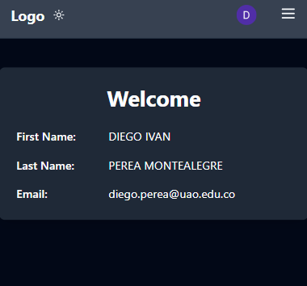

### Nextjs-clerk-tailwind-ts

<p align="justify">
Nextjs clerk and typescript Tailwind responsive.
</p>

<p align="justify">
This repository offers a template for developing web applications with Next.js, Clerk for authentication, TypeScript for static typing, and Tailwind CSS for a modern, responsive design. Ideal for fast, scalable projects with an optimized configuration.
</p>

Home
<p align="center">
  
</p>
Home mobile
<p align="center">
  
</p>

Navbar responsive
<p align="center">
  
</p>

Sig in
<p align="center">
  
</p>

Sig up
<p align="center">
  
</p>

Home login
<p align="center">
  
</p>

Navbar login 
<p align="center">
  
</p>

Dashboard
<p align="center">
  
</p>
Dashboard mobile
<p align="center">
  
</p>

Create .env.local by the .env
-----

Fronted Nextjs Options for do it:

This is a [Next.js](https://nextjs.org/) project bootstrapped with [`create-next-app`](https://github.com/vercel/next.js/tree/canary/packages/create-next-app).

## Getting Started
Nodejs version v20.18.0 and Next.js version v15

First
```bash
npm install
```
run the development server:

```bash
npm run dev
# or
yarn dev
# or
pnpm dev
# or
bun dev
```
Please uncommeted the .env in gitignore if you do deploy 

Open [http://localhost:3000](http://localhost:3000) with your browser to see the result.

Created by [Diego Ivan Perea Montealegre](https://github.com/diegoperea20)